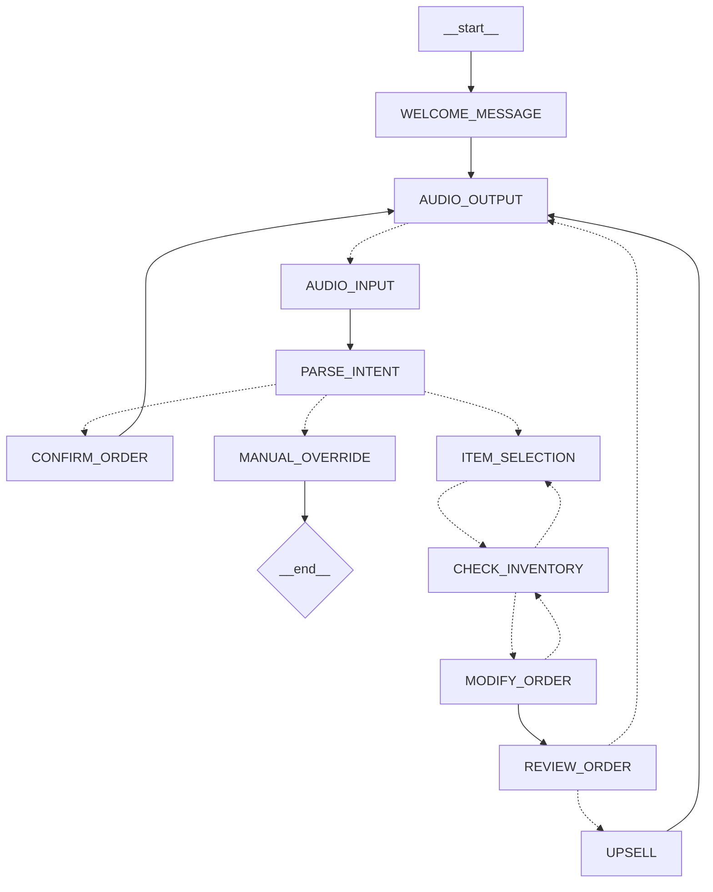

# AI Fast Food Order Entry Voice Agent

This project implements a conversational AI voice agent designed specifically for taking food orders at a fast-food restaurant. It leverages LangGraph for managing the conversation flow and interacts with a database for menu information and order persistence. And once the order is confirmed the agent returns a draft order object that can be used to send the order to a third-party service or store it in a database.

## Architecture



*   **State Management:** The conversation's state is tracked using [`AgentStateAnnotation`](src/agent/state.ts), which includes messages, the current draft order, database query results, and internal flow control flags. Configuration details like `businessName` or `language` are passed via [`ConfigurationAnnotation`](src/agent/state.ts).
*   **Core Nodes:** The graph operates through distinct nodes, each representing a stage in the order process (constants defined in [`src/helpers/constants.ts`](src/helpers/constants.ts)):
    *   `WELCOME_MESSAGE`: Greets the user and initiates the order.
    *   `AUDIO_INPUT`: Captures the user's spoken input.
    *   `PARSE_INTENT`: Analyzes the user's input to determine their goal (e.g., add item, modify order, confirm).
    *   `CHECK_INVENTORY`: Queries the database for menu items, prices, and available modifiers based on the user's request.
    *   `ITEM_SELECTION`: Adds validated items to the draft order.
    *   `MODIFY_ORDER`: Updates the draft order (e.g., adds modifiers, changes quantity, removes items).
    *   `REVIEW_ORDER`: Summarizes the current draft order for the user to review.
    *   `CONFIRM_ORDER`: Finalizes the order details and provides a concluding message.
    *   `AUDIO_OUTPUT`: Sends the agent's spoken response back to the user.
*   **Conversation Flow:**
    1.  The interaction begins with the `WELCOME_MESSAGE`.
    2.  The agent cycles through `AUDIO_INPUT` to capture user speech and `PARSE_INTENT` to understand it.
    3.  Based on the intent, the flow branches to nodes like `ITEM_SELECTION`, `MODIFY_ORDER`, or `CONFIRM_ORDER`.
    4.  Nodes involving menu items (`ITEM_SELECTION`, `MODIFY_ORDER`) typically use `CHECK_INVENTORY` first.
    5.  After updates, the flow often proceeds to `REVIEW_ORDER`.
    6.  Nodes requiring a response (`REVIEW_ORDER`, `CONFIRM_ORDER`, error handling) lead to `AUDIO_OUTPUT`.
    7.  This cycle repeats until the order is finalized via `CONFIRM_ORDER` or the conversation ends.
*   **Persistence:** Conversation state checkpoints are managed using `MemorySaver` for short-term memory. (Note: This can be swapped with a persistent solution like a Postgres checkpointer if needed).
*   **Database:** A SQLite database, managed via TypeORM ([`src/helpers/db.ts`](src/helpers/db.ts)), stores information about categories, products (menu items), modifiers, and finalized orders.


## Functionality Overview

1.  **Initialization:** Connects to the SQLite database ([`initializeDatabase`](src/helpers/db.ts)).
2.  **Greeting:** Starts the conversation with a welcome message ([`welcomeMessageNode`](src/nodes/welcome-message.ts)).
3.  **Order Taking Loop:**
    *   Listens for and processes user voice input ([`audioInputNode`](src/nodes/audio-input.ts)).
    *   Determines the user's intent ([`parseIntentNode`](src/nodes/parse-intent.ts)).
    *   **Handles Item Addition:** Checks item availability ([`checkInventoryNode`](src/nodes/check-inventory.ts)) and adds it to the order ([`itemSelectionNode`](src/nodes/item-selection.ts)).
    *   **Handles Order Modification:** Checks modifier availability if necessary ([`checkInventoryNode`](src/nodes/check-inventory.ts)) and updates the order ([`modifyOrderNode`](src/nodes/modify-order.ts)).
    *   **Reviews Order:** Presents the current order details to the user ([`reviewOrderNode`](src/nodes/review-order.ts)).
    *   **Confirms Order:** Finalizes the transaction upon user confirmation ([`confirmOrderNode`](src/nodes/confirm-order.ts)).
    *   Provides voice responses throughout the process ([`audioOutputNode`](src/nodes/audio-output.ts)).
4.  **Termination:** The conversation concludes upon successful order confirmation or user exit.
5.  **Language Support:** Defaults to English (`en`). But Spanish, French, and German are also supported. 

## Core Components

*   **Graph Definition:** [`src/agent/graph.ts`](src/agent/graph.ts) - Defines the conversational flow structure.
*   **State Management:** [`src/agent/state.ts`](src/agent/state.ts) - Defines the data tracked during the conversation.
*   **Node Logic:** [`src/nodes/`](nodes) - Contains the implementation for each step (node) in the graph.
*   **LLM Prompts:** [`src/agent/prompts.ts`](src/agent/prompts.ts) - Stores the prompts used to guide the language model.
*   **Helpers & Utilities:** [`src/helpers/`](src/helpers) - Includes database setup, constants, type definitions, and utility functions.
*   **Database Schema:** [`src/helpers/db.ts`](src/helpers/db.ts) - Defines database tables using TypeORM entities.
*   **Database Seeding:** [`src/helpers/seed.ts`](src/helpers/seed.ts) - Script to populate the database with initial menu data.

## Prerequisites

*   Bun installed.
*   Environment Variables: Ensure necessary environment variables are set.
*   Database seeded with initial menu data.

## Setup

1.  **Install Dependencies:**
    ````bash
    bun install
    ````
2. **Environment Variables:** Create a `.env` file in the root directory and set the required environment variables. You can use the `.env.example` file as a reference.
    ````bash
    cp .env.example .env
    ````
3.  **Seed Database:** (Run this once to populate the menu)
    ````bash
    bun run seed
    ````

## Usage

1.  **Run the Agent:**
    ````bash
    bun run studio 
    ````
This will start LangGraph studio which will allow you to test the agent in a web interface.

